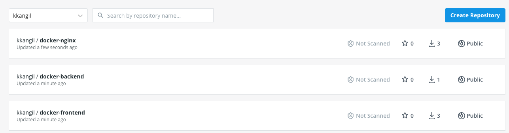

# docker-node-react-app

docker 를 사용하여 풀스택 앱 배포하기

- routing: Nginx
- backend: Node.js
- database: Mysql
- frontend: React

위의 환경에 대한 Dockerfile 를 각각 생성하여 docker-compose 기능을 사용하여,
multi-container 방식으로 앱을 구동시킨다.

```shell script
docker-compose up
```

## 구현 방식


- 최초 Client 에서 요청이 올때 Nginx proxy 설정해준다. /api 경로를 포함하고 있는 경우 Server,
포함하지 않는 경우 Front 로 요청된다.
- Front 서버로 요청되는 경우 위의 Nginx 가 아닌 Front 파일을 Serving 해주기 위한 별도의 
Nginx 를 구성한다. (React 가 build 후 정적인 파일로 생성되기 때문.)
- /api 경로를 포함하고 있는 경우 Node Server 로 요청되고 해당 요청에 대한 API 가 존재하는 경우
MySQL DB server 와 통신한다. 

### Nginx proxy

장점
- request 를 보낼때 URL 부분을 host 이름이 바뀌어도 변경시켜 주지 않아도 된다.
- 포트가 바뀌어도 변경을 안해주어도 된다.

단점
- nginx 설정, 전체 설계가 다소 복잡하다.

위의 이미지와 같은 설계가 아닌, Nginx 는 정적파일만 제공해 주는 설계로 구현한 경우

장점
- 설계가 다소 간단하여 구현하는게 더 쉽다.

단점
- host name 이나 포트 변경이 있을때 request URL 도 변경시켜주어야 한다.

### 리액트를 위한 Nginx 설정

```
server {
  listen 3000;

  location / {

    root /usr/share/nginx/html;

    index index.html index.htm;

    try_files $uri  $uri/ /index.html;

  }
}
```

- root: HTML 파일이 위치할 루트 설정
- index: 사이트의 index 페이지로 할 파일명 설정
- try_files: React Router 를 사용해서 페이지간 이동을 할때 필요한 부분.

위의 설정 파일 (default.conf) 을 만들어 준 후 Dockerfile Nginx 부분에
기존 설정(/etc/nginx/conf.d/default.conf) 을 해당 파일로 바꿀수 있도록 추가해준다.

```dockerfile
FROM nginx
EXPOSE 3000
COPY ./nginx/default.conf /etc/nginx/conf.d/default.conf
COPY --from=builder /app/build /usr/share/nginx/html
```

### MySQL 설정 주의 사항

utf-8 설정을 해주지 않으면 한글이 깨질수 있어 mysql character 설정을 해주고, 
기본 설정 파일을 변경해야함.

```
[mysqld]
character-set-server=utf8

[mysql]
deafult-character-set=utf8

[client]
deafult-character-set=utf8
```

```dockerfile
FROM mysql:5.7
ADD ./my.cnf /etc/mysql/conf.d/my.cnf
```

### Nginx for proxy Dockerfile

```
upstream frontend {
  server frontend:3000;
}

upstream backend {
  server backend:5000;
}

server {
  listen 80;

  location / {
    proxy_pass http://frontend;
  }

  location /api {
    proxy_pass http://backend;
  }

  location /sockjs-node {
    proxy_pass http://frontend;
    proxy_http_version 1.1;
    proxy_set_header Upgrade $http_upgrade;
    proxy_set_header Connection "Upgrade";
  }
}
```

upstream *** -> *** 라는 이름은 docker-compose 의 service 에 들어갈 이름을 넣어주면 된다.

> /sockjs-node 설정은 리액트를 위해 넣어준 것으로, 해당 내용을 적어주지 않으면
> 에러가 발생함.

### Docker-compose file

#### nginx 의 restart : 재시작 정책

- no: 어떠한 상황에서도 재시작을 하지 않는다.
- always: 항상 재시작
- on-failure: on-failure 에러코드와 함께 컨테이너가 멈추었을때만 재시작
- unless-stopped: 개발자가 임의로 멈추려고 할때 빼고는 항상 재시작

#### mysql volumes

컨테이너를 지우면 컨테이너 안의 저장된 데이터도 삭제된다.
mysql 볼륨 설정을 통해 데이터가 삭제되지 않게 해줄 수 있다.

### Travis CI

1. 테스트 코드 실행
2. 성공하면 운영 환경 이미지 build
3. 빌드 된 이미지들을 Docker Hub 로 보냄 -> docker hub 에 빌드된 이미지를 보내고 aws 에서 그 이미지를 가져가므로 
eb 안에서 다시 이미지를 빌드 하지 않아도 됌 (모든 과정중에 한번의 빌드만 이뤄짐)
4. aws eb 에게 docker hub 에 이미지를 보냈다고 알림
5. aws eb 에서 docker hub 에 있는 이미지를 가져간 후 배포



### Dockerrun.aws.json

하나의 Dockerfile 을 사용하면 Elastic Beanstalk 이 알아서 App 을 실행시켜 주지만
여러개의 Dockerfile 을 사용할때는 EB 가 어떤 파일을 먼저 실행하고
어떻게 행동을 취해야 하는지 설정(작업 정의: Task Definition) 해줘야 한다.

> Dockerrun.aws.json 파일은 Docker 컨테이너 세트를 EB 애플리케이션으로 배포하는
> 방법을 설명하는 EB 고유의 JSON 파일이다. Dockerrun.aws.json 파일을 멀티컨테이너
> Docker 환경에 사용할 수 있다.
>
> Dockerrun.aws.json 은 환경에서 각 컨테이너 인스턴스에 배포할 컨테이너 및 탑재할
> 컨테이너의 호스트 인스턴스에서 생성할 데이터 볼륨을 설명한다.

- AWSESDockerrunVersion: Dockerrun 의 버전
- containerDefinitions: 이 안에서 컨테이너들을 정의한다. 하나의 객체가 하나의 컨테이너
- container.name : 컨테이너 이름
- container.image : Docker 컨테이너를 구축할 온라인 Docker repository 의 docker 이미지 이름
- container.hostname: 이 이름을 이용해서 docker-compose 를 이용해 생성된 다른 컨테이너에서 접근 가능
- container.essential: 컨테이너가 실패할 경우 작업을 중지해야 하면 true, 필수적이지 않은 컨테이너는
인스턴스의 나머지 컨테이너에 영향을 미치지 않고 종료되거나 충돌할 수 있다.
- container.memory : 컨테이너가 얼마의 메모리를 사용할 지 설정.
- container.portMapping : 컨테이너에 있는 네트워크 지점을 호스트에 있는 지점에 매핑
- container.links : 연결한 컨테이너의 목록. 연결된 컨테이너는 서로를 검색하고 안전하게 통신할 수 있다.

### EB

애플리케이션을 생성할때 플랫폼을 Docker 의 multi-container 환경을 선택해야함.

### VPC 와 Security Group 설정

AWS 의 RDS 를 이용하여 MYSQL 을 애플리케이션과 연결하기위해서 VPC 와 Security Group 설정을 해줘야 한다.

같은 VPC 오는 트래픽은 모두 허용해주는 Security Group 을 적용하여 EB 인스턴스와 RDS 가 통신할 수 있게
설정해준다.

#### VPC

AWS 에서 만든 EC2 인스턴스나 EB 인스턴스 혹은 RDS 를 만들었다면 이러한 인스턴스들을 나의 아이디에서만
접근이 가능하게 논리적으로 격리된 네트워크에서 생성이 되게 해준다. 그러기에 다른 아이디로는 접근 하는것은
물론 보는것도 불가능하다.

EB 인스턴스나 RDS 를 생성하면 자동적으로 기본 VPC 가 할당된다. 할당될 때는 지역별로 다르게 할당된다.

#### Security Group (방화벽)

- inbound: 외부에서 EC2 인스턴스나 EB 인스턴스로 요청을 보내는 트래픽. HTTP, HTTPS, SSH 등
- outbound: EC2 인스턴스나 EB 인스턴스등에서 외부로 나가는 트래픽. 파일을 다운로드 하거나 inbound 로 
들어온 트래픽을 처리하여 응답하는 경우

Security Group 이 inbound 와 outbound 를 통제해서 트래픽을 열어주고 닫아줄 수 있다.

### RDS 생성시 주의사항

RDS 설정의 자격 증명 설정
- 마스터 이름: $MYSQL_USER
- 마스터 암호: $MYSQL_ROOT_PASSWORD

추가 구성의 초기 데이터베이스 이름: $MYSQL_DATABASE
