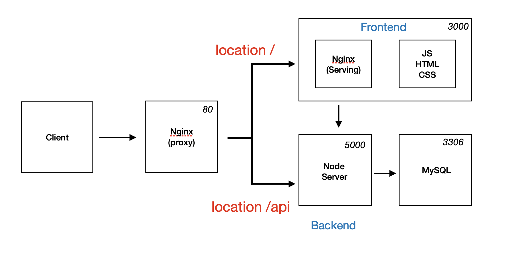

# docker-node-react-app

docker 를 사용하여 풀스택 앱 배포하기

- routing: Nginx
- backend: Node.js
- database: Mysql
- frontend: React

위의 환경에 대한 Dockerfile 를 각각 생성하여 docker-compose 기능을 사용하여,
multi-container 방식으로 앱을 구동시킨다.

```shell script
docker-compose up
```

## 구현 방식



- 최초 Client 에서 요청이 올때 Nginx proxy 설정해준다. /api 경로를 포함하고 있는 경우 Server,
포함하지 않는 경우 Front 로 요청된다.
- Front 서버로 요청되는 경우 위의 Nginx 가 아닌 Front 파일을 Serving 해주기 위한 별도의 
Nginx 를 구성한다. (React 가 build 후 정적인 파일로 생성되기 때문.)
- /api 경로를 포함하고 있는 경우 Node Server 로 요청되고 해당 요청에 대한 API 가 존재하는 경우
MySQL DB server 와 통신한다. 

### Nginx proxy

장점
- request 를 보낼때 URL 부분을 host 이름이 바뀌어도 변경시켜 주지 않아도 된다.
- 포트가 바뀌어도 변경을 안해주어도 된다.

단점
- nginx 설정, 전체 설계가 다소 복잡하다.

위의 이미지와 같은 설계가 아닌, Nginx 는 정적파일만 제공해 주는 설계로 구현한 경우

장점
- 설계가 다소 간단하여 구현하는게 더 쉽다.

단점
- host name 이나 포트 변경이 있을때 request URL 도 변경시켜주어야 한다.

### 리액트를 위한 Nginx 설정

```
server {
  listen 3000;

  location / {

    root /usr/share/nginx/html;

    index index.html index.htm;

    try_files $uri  $uri/ /index.html;

  }
}
```

- root: HTML 파일이 위치할 루트 설정
- index: 사이트의 index 페이지로 할 파일명 설정
- try_files: React Router 를 사용해서 페이지간 이동을 할때 필요한 부분.

위의 설정 파일 (default.conf) 을 만들어 준 후 Dockerfile Nginx 부분에
기존 설정(/etc/nginx/conf.d/default.conf) 을 해당 파일로 바꿀수 있도록 추가해준다.

```dockerfile
FROM nginx
EXPOSE 3000
COPY ./nginx/default.conf /etc/nginx/conf.d/default.conf
COPY --from=builder /app/build /usr/share/nginx/html
```

### MySQL 설정 주의 사항

utf-8 설정을 해주지 않으면 한글이 깨질수 있어 mysql character 설정을 해주고, 
기본 설정 파일을 변경해야함.

```
[mysqld]
character-set-server=utf8

[mysql]
deafult-character-set=utf8

[client]
deafult-character-set=utf8
```

```dockerfile
FROM mysql:5.7
ADD ./my.cnf /etc/mysql/conf.d/my.cnf
```

### Nginx for proxy Dockerfile

```
upstream frontend {
  server frontend:3000;
}

upstream backend {
  server backend:5000;
}

server {
  listen 80;

  location / {
    proxy_pass http://frontend;
  }

  location /api {
    proxy_pass http://backend;
  }

  location /sockjs-node {
    proxy_pass http://frontend;
    proxy_http_version 1.1;
    proxy_set_header Upgrade $http_upgrade;
    proxy_set_header Connection "Upgrade";
  }
}
```

upstream *** -> *** 라는 이름은 docker-compose 의 service 에 들어갈 이름을 넣어주면 된다.

> /sockjs-node 설정은 리액트를 위해 넣어준 것으로, 해당 내용을 적어주지 않으면
> 에러가 발생함.

### Docker-compose file

#### nginx 의 restart : 재시작 정책

- no: 어떠한 상황에서도 재시작을 하지 않는다.
- always: 항상 재시작
- on-failure: on-failure 에러코드와 함께 컨테이너가 멈추었을때만 재시작
- unless-stopped: 개발자가 임의로 멈추려고 할때 빼고는 항상 재시작

#### mysql volumes

컨테이너를 지우면 컨테이너 안의 저장된 데이터도 삭제된다.
mysql 볼륨 설정을 통해 데이터가 삭제되지 않게 해줄 수 있다.
